<!--
╔══════════════════════════════════════════════════════════════════╗
║                    NIUMINATION — v1.0.0                       ║
║  Afrizal Munthe (Niumination) | Pranata Komputer, Diskominfo   ║
║  Aceh Tengah                                                    ║
║                                                                 ║
║  Auto-generated: DO NOT EDIT THIS FILE DIRECTLY.                ║
║  Edit profile.config.json → npm run generate:readme             ║
╚══════════════════════════════════════════════════════════════════╝
-->

<picture>
  <source media="(prefers-color-scheme: dark)" srcset="assets/hero/terminal-animated.svg">
  
</picture>

<picture>
  <source media="(prefers-color-scheme: dark)" srcset="assets/hero/ecosystem-animated.svg">
  
</picture>

# 𝙽𝚒𝚞𝚖𝚒𝚗𝚊𝚝𝚒𝚘𝚗

**Afrizal Munthe** — 𝙿𝚛𝚊𝚗𝚊𝚝𝚊 𝙺𝚘𝚖𝚙𝚞𝚝𝚎𝚛 @ 𝙳𝚒𝚜𝚔𝚘𝚖𝚒𝚗𝚏𝚘 𝙰𝚌𝚎𝚑 𝚃𝚎𝚗𝚐𝚊𝚑

`SPBE · GovTech · AI Agents · Fullstack · Open Source`

---

## Tentang Saya

Saya **Afrizal Munthe (Niumination)** — Pranata Komputer di Diskominfo Aceh Tengah. Fokus pada transformasi digital pemerintahan melalui **Sistem Pemerintahan Berbasis Elektronik (SPBE)** dan pengembangan ekosistem **AI Agent** untuk layanan publik.

Ekosistem saya mencakup **40+ repositori aktif** — dari portal desa SSG hingga AI multi-agent orchestrator — semuanya dibangun dengan standar high-agency engineering: surgical patch, zero redundancy, dan measurable outcome.

---

## Fokus Saat Ini

| Area | Deskripsi |
|------|-----------|
| **SPBE & GovTech** | Sistem Pemerintahan Berbasis Elektronik — portal OPD, KMS, LKH, interoperabilitas layanan publik Aceh Tengah |
| **AI Agent Ecosystem** | Multi-agent orchestration, Hermes Agent, JCode bridge, dan autonomous workflow untuk otomatisasi tugas pemerintahan |
| **Fullstack Web** | Next.js, React, Three.js, Prisma, TanStack Query — dashboard real-time, portal statis, dan aplikasi hybrid |
| **Desktop & Mobile** | Tauri 2 (Rust/React), PyQt5 (ADB tooling), Kotlin/Jetpack Compose (AI File Organizer) — aplikasi native yang interoperable |

---

## Featured Projects

| Proyek | Fokus | Stack | Deploy |
|--------|-------|-------|--------|
| [**PemdiAcehTengah**](https://github.com/Niumination/PemdiAcehTengah) | Portal Pemerintah Digital — 52 OPD, 70 pages SSG | Next.js 14, React 18, pure CSS | 🟢 [Vercel](https://pemdi-aceh-tengah.vercel.app) |
| [**niu-dash**](https://github.com/Niumination/niu-dash) | Ecosystem dashboard — 76+ proyek tracked, v2.16.8 | Vanilla JS, HTML/CSS | 🟢 [GH Pages](https://niumination.github.io/niu-dash) |
| [**Flame-ADE**](https://github.com/Niumination/Flame-ADE) | AI-native terminal emulator — Tauri 2 + Rust + React 19 | Tauri 2, Rust, React 19 | 🟢 GitHub |
| [**Niu-LKH**](https://github.com/Niumination/Niu-LKH) | Laporan Keuangan Hijau v3.1.1 — 100% Done 🎉 | React 19, Vite 6, Tailwind v4, Supabase | 🟢 [GH Pages](https://niumination.github.io/Niu-LKH) |
| [**didong-code**](https://github.com/Niumination/didong-code) | Agentic Dev Environment — Electron + React + TypeScript | Electron, React 18, TypeScript | 🟢 GitHub |
| [**kune-ya.com**](https://github.com/Niumination/kune-ya.com) | AI Chat dengan Retrieval-Augmented Generation | React, TypeScript, Vercel | 🟢 [Vercel](https://kune-ya.com) |
| [**niu-dash-fullstack**](https://github.com/Niumination/niu-dash-fullstack) | Next.js 16 fullstack dashboard — Prisma, Three.js | Next.js 16, React 19, Prisma 7 | ⚪ Local |
| [**mac-web-dashboard**](https://github.com/Niumination/mac-web-dashboard) | macOS Dashboard v1.1.0 — +AI Workspace | Next.js 14, React 18, Tailwind | 🟢 GitHub |

---

## Tech Stack

```
TypeScript  JavaScript  Python  Rust
Next.js     React       Tailwind CSS  Prisma
PostgreSQL  Supabase    Three.js      Tauri 2
Node.js     Kotlin      Qdrant        Ollama
```

---

## Research Direction

Saya fokus pada sistem di mana AI Agent tidak hanya menghasilkan teks — mereka mengamati state, memanggil alat, bernalar tentang risiko, berkoordinasi dengan agen lain, dan mengambil tindakan terbatas dengan bukti yang transparan.

North star saya adalah membangun **sistem otonom yang dapat dipercaya** untuk pemerintahan digital — yang bisa beroperasi di lingkungan nyata tanpa menyembunyikan lapisan penalaran, verifikasi, dan keamanan di balik antarmuka.

---

## Recent Activity

<!-- ACTIVITY_START -->
Loading recent GitHub activity...
<!-- ACTIVITY_END -->

---

> *Membangun ekosistem digital untuk Aceh Tengah — SPBE, AI Agents, dan open-source governance.*

---

<details>
<summary><b>📊 GitHub Stats</b></summary>
<br>

<br>

</details>

<details>
<summary><b>📁 Ekosistem Lengkap (40+ repositori)</b></summary>
<br>

### 🏛️ Pemerintahan & SPBE
| Repo | Status | Deploy |
|------|--------|--------|
| PemdiAcehTengah | 🟢 Active | [Vercel](https://pemdi-aceh-tengah.vercel.app) |
| cc-acehtengah | 🔜 Fase 1 | Local |
| Niu-LKH | ✅ 100% | [GH Pages](https://niumination.github.io/Niu-LKH) |
| AuditTI-AT | ✅ Live | [GH Pages](https://niumination.github.io/AuditTI-AT) |
| kms-spbe | ✅ Live | Vercel |

### 🤖 AI & Coding Agent
| Repo | Status | Stack |
|------|--------|-------|
| Flame-ADE | ✅ v1.3.0 | Tauri 2, Rust, React |
| Niu-Flow | 🟢 Active | Python, JCode bridge |
| orchestrator | ✅ Pushed | Python multi-agent |
| didong-code | 🆕 New | Electron, React 18 |

### 🌐 Web Apps & Tools
| Repo | Status | Stack |
|------|--------|-------|
| niu-dash | 🟢 v2.16.8 | Vanilla JS |
| niu-dash-fullstack | ✅ Active | Next.js 16, Prisma 7 |
| mac-web-dashboard | ✅ v1.1.0 | Next.js 14 |
| x-downloader | ✅ v2.0.0 | Tauri 2, Rust, React |
| TEDEO | ✅ T1-T4 Fixed | Express, React, PostgreSQL |
| niumination-workspace | ✅ Active | Next.js 16, Three.js |

</details>
